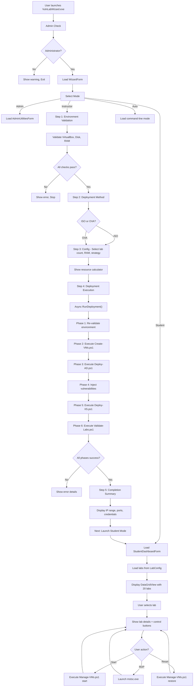

# VulnLabWizard Architecture

## System Overview

VulnLabWizard is a single .EXE Windows application (~15-20MB) that automates deployment, management, and access to 20 Windows Server 2022 vulnerability labs. It consists of:

- **UI Layer**: Windows Forms (.NET Framework 4.8+)
- **Business Logic Layer**: C# services for orchestration
- **Automation Layer**: Embedded PowerShell scripts
- **Data Layer**: Embedded JSON configuration files

---

## Application Structure

```
VulnLabWizard.exe (~15-20MB)
│
├─ UI Layer (WinForms)
│  ├─ WizardForm.cs              Main wizard container
│  ├─ ModeSelectorForm.cs        Mode selection (Instructor/Student/Admin/Auto)
│  ├─ StudentDashboardForm.cs    Lab dashboard with controls
│  └─ AdminUtilitiesForm.cs      Admin operations panel
│
├─ Services Layer (Business Logic)
│  ├─ ScriptExecutor.cs          PowerShell script executor
│  ├─ EnvironmentValidator.cs    System validation (VirtualBox, disk, RAM)
│  ├─ VirtualBoxService.cs       VBoxManage wrapper
│  └─ LogService.cs              Centralized logging
│
├─ Models Layer (Data)
│  ├─ LabDefinition.cs           Single lab data structure
│  ├─ LabConfig.cs               Loads all 20 lab definitions
│  └─ DeploymentState.cs         Deployment configuration tracking
│
├─ Resources (Embedded)
│  ├─ PowerShell Scripts (7)
│  │  ├─ Create-VMs.ps1          VM creation orchestration
│  │  ├─ Deploy-AD.ps1           Active Directory setup
│  │  ├─ Deploy-IIS.ps1          IIS application deployment
│  │  ├─ Import-OVA.ps1          OVA file import
│  │  ├─ Manage-VMs.ps1          VM lifecycle operations
│  │  ├─ Validate-Labs.ps1       Lab validation
│  │  └─ utilities.ps1            Helper functions
│  │
│  ├─ Configuration Files (3)
│  │  ├─ lab-config.json         20 lab definitions
│  │  ├─ vulnerabilities.json    Vulnerability profiles
│  │  └─ default-settings.ini    Default configuration
│  │
│  └─ Documentation
│     ├─ README.md               User guide
│     ├─ ARCHITECTURE.md         System design (this file)
│     └─ DISCUSSIONS.md          Design decisions
│
└─ Program.cs
   Entry point, admin check, main form launch
```

---

## Data Flow Architecture

### Instructor Mode Deployment Flow

```
User launches VulnLabWizard.exe
    ↓
Program.cs checks Administrator privileges
    ↓
WizardForm loads → ModeSelectorForm (Step 1)
    ↓ [User selects "Instructor Mode"]
    ↓
ShowEnvironmentValidation (Step 2)
├─ EnvironmentValidator.ValidateEnvironmentForDeployment()
├─ Check: VirtualBox installed?
├─ Check: Sufficient disk space? (dynamic based on lab count)
├─ Check: Sufficient RAM? (dynamic based on lab count + strategy)
└─ Report: All checks pass → Continue
    ↓
ShowDeploymentMethodSelection (Step 3)
├─ User chooses: ISO or OVA
└─ File browser: Select Windows Server 2022 ISO or OVA
    ↓
ShowConfigurationForm (Step 4) - WITH PHASE 1 ENHANCEMENTS
├─ Lab Prefix: "VulnLab" (default)
├─ Lab Count: [5 labs, 10 labs, 15 labs, 20 labs] ← NEW
├─ RAM Per VM: [1GB ... 4GB] slider ← NEW
├─ Deployment Strategy: [Sequential, Simultaneous] ← NEW
├─ Network IP Start: "192.168.56.100"
├─ Port Range Start: "5100"
├─ Domain Name: "hackossem.local"
├─ Domain Admin Password: "P@ssw0rd!2024"
├─ Dynamic Resource Calculator ← NEW
└─ Saves to DeploymentState
    ↓
ShowDeploymentExecution (Step 5) - WITH PHASE 2 IMPLEMENTATION
├─ RunDeployment() async task started
├─ Phase 1: Environment re-validation
├─ Phase 2: Call Create-VMs.ps1
│  └─ ScriptExecutor extracts script from resources
│  └─ Execute: powershell.exe -NoProfile -ExecutionPolicy Bypass
│  └─ Pass parameters: -LabCount, -MemoryGB, -IsSequential
│  └─ Capture output in real-time, update progress bar
├─ Phase 3: Call Deploy-AD.ps1
├─ Phase 4: Vulnerability injection (simulated)
├─ Phase 5: Call Deploy-IIS.ps1
├─ Phase 6: Call Validate-Labs.ps1
└─ Save completion status
    ↓
ShowCompletionSummary (Step 6) - WITH PHASE 2 ENHANCEMENT
├─ Display: Total VMs created (dynamic)
├─ Display: IP range (dynamic)
├─ Display: RDP/WinRM port ranges (dynamic)
├─ Display: Domain credentials
└─ Next steps: Launch Student Mode or RDP
```

### Student Mode Dashboard Flow

```
User selects "Student Mode"
    ↓
StudentDashboardForm loads
    ↓
LabConfig loads all 20 lab definitions
    ↓
DataGridView displays:
├─ Lab ID
├─ Lab Name
├─ Difficulty (with color coding)
├─ Current Status
└─ RDP Port
    ↓
User selects a lab (Row click)
    ↓
ShowLabDetails() displays:
├─ Lab Name, Difficulty, Vulnerability Type
├─ IP Address, RDP Port, WinRM Port
├─ Lab Description
└─ Control Buttons:
   ├─ [Start Lab] → Calls Manage-VMs.ps1 "start"
   ├─ [Stop Lab] → Calls Manage-VMs.ps1 "stop"
   ├─ [Reset to Snapshot] → Calls Manage-VMs.ps1 "restore"
   ├─ [RDP Connect] → Launches mstsc.exe 127.0.0.1:<port>
   ├─ [View Credentials] → Shows popup with lab credentials
   └─ [View Guide] → Opens exploitation guide document
    ↓
User connects to lab via RDP
    ↓
User begins exploitation exercise
```

---

## Service Layer Details

### ScriptExecutor Service
**Purpose**: Execute embedded PowerShell scripts with output capture

```csharp
public class ScriptExecutor
{
    // Execute embedded script by name
    public bool ExecuteScript(string scriptName, string arguments)
    {
        // 1. Extract script from resources to %TEMP%
        // 2. Spawn powershell.exe with script
        // 3. Capture stdout/stderr line-by-line
        // 4. Call logCallback for each line
        // 5. Return exit code (true if 0)
    }
}
```

**Flow**:
```
Input: scriptName="Create-VMs.ps1", args="-LabCount 20 -MemoryGB 2"
    ↓
Extract: Get resource stream from embedded "VulnLabWizard.Resources.Create-VMs.ps1"
    ↓
Write to: %TEMP%\Create-VMs_<random>.ps1
    ↓
Execute: powershell.exe -NoProfile -ExecutionPolicy Bypass -File <tempfile>
    ↓
Capture: Real-time output, invoke logCallback()
    ↓
Return: exit code == 0 ? true : false
```

### EnvironmentValidator Service
**Purpose**: Validate system prerequisites before deployment

```csharp
public class EnvironmentValidator
{
    // Flexible validation based on deployment configuration
    public bool ValidateEnvironmentForDeployment(
        int labCount, 
        int ramPerVmGB, 
        bool isSequentialDeployment)
    {
        // Check 1: VirtualBox installed?
        // Check 2: Sufficient disk space for labCount VMs?
        // Check 3: Sufficient RAM for strategy?
        //   - Sequential: 2 × ramPerVmGB
        //   - Simultaneous: labCount × ramPerVmGB
    }
}
```

**Validation Logic**:
```
VirtualBox Check:
  → Run: VBoxManage --version
  → Expected: Exit code 0 + version string
  
Disk Space Check (Dynamic):
  → Required: labCount × 10GB per VM
  → Actual: Check drive.AvailableFreeSpace
  → Pass: Actual > Required
  
RAM Check (Dynamic + Strategy-Aware):
  → If Sequential: Required = 2 × ramPerVmGB
  → If Simultaneous: Required = labCount × ramPerVmGB
  → Actual: Get-WmiObject Win32_ComputerSystem.TotalPhysicalMemory
  → Pass: Actual > Required
```

### VirtualBoxService
**Purpose**: Wrapper around VBoxManage CLI

```csharp
public class VirtualBoxService
{
    // Execute VBoxManage commands
    private void ExecuteCommand(string command, string[] args)
    {
        ProcessStartInfo psi = new ProcessStartInfo("VBoxManage", 
            $"{command} {string.Join(" ", args)}");
        // ... execute and return output
    }
    
    // High-level operations
    public bool CreateVM(string vmName, int memoryMB, int cpuCount)
    public bool StartVM(string vmName)
    public bool StopVM(string vmName)
    public bool CloneVM(string sourceVm, string targetVm)
}
```

### LogService
**Purpose**: Centralized logging to UI and file

```csharp
public class LogService
{
    // Log to UI and file
    public void LogMessage(string message)
    {
        // 1. Append to logTextBox in UI
        // 2. Append to log file (%TEMP%\VulnLabWizard_*.log)
        // 3. Add timestamp: [yyyy-MM-dd HH:mm:ss]
    }
}
```

---

## Data Models

### LabDefinition.cs
Represents a single lab.

```csharp
public class LabDefinition
{
    public string Id { get; set; }              // "Easy-1"
    public string Name { get; set; }            // "Weak Password Policy"
    public string Difficulty { get; set; }      // "Easy", "Medium", "Hard"
    public string VmName { get; set; }          // "VulnLab-ad-lab-1"
    public string IpAddress { get; set; }       // "192.168.56.100"
    public int RdpPort { get; set; }            // 5100
    public int WinrmPort { get; set; }          // 2100
    public string VulnerabilityType { get; set; } // "Credential Theft"
    public string Description { get; set; }
    public string[] Tags { get; set; }
}
```

### LabConfig.cs
Loads all 20 labs from embedded JSON.

```csharp
public class LabConfig
{
    public List<LabDefinition> Labs { get; set; }
    
    // Constructor loads from embedded lab-config.json
    public LabConfig()
    {
        var assembly = Assembly.GetExecutingAssembly();
        var resource = assembly.GetManifestResourceStream(
            "VulnLabWizard.Resources.lab-config.json");
        Labs = JsonSerializer.Deserialize<LabConfigRoot>(resource).Labs;
    }
}
```

### DeploymentState.cs
Tracks deployment configuration (Phases 1-3 enhancements).

```csharp
public class DeploymentState
{
    // Basic config
    public string Mode { get; set; }                      // "instructor", "student", "admin", "auto"
    public string DeploymentMethod { get; set; }          // "iso" or "ova"
    public string LabPrefix { get; set; } = "VulnLab";
    public string NetworkIpStart { get; set; } = "192.168.56.100";
    public int PortRangeStart { get; set; } = 5100;
    public string DomainName { get; set; } = "hackossem.local";
    public string DomainAdminPassword { get; set; } = "P@ssw0rd!2024";
    
    // Hardware config
    public int VmMemoryMB { get; set; } = 2048;           // Deprecated (kept for compat)
    public int VmCpuCount { get; set; } = 2;
    
    // Flexible deployment (Phase 1)
    public int LabCount { get; set; } = 20;               // NEW
    public int RamPerVmGB { get; set; } = 2;              // NEW
    public bool IsSequentialDeployment { get; set; } = true; // NEW
    
    // Deployment tracking
    public bool CreateSnapshots { get; set; } = true;
    public bool ValidateAfter { get; set; } = true;
    public int CurrentStep { get; set; } = 0;
    public DateTime StartTime { get; set; }
    public bool IsInProgress { get; set; } = false;
}
```

---

## PowerShell Script Interface

All scripts are called from C# with parameters:

### Create-VMs.ps1 (Updated for Phase 1)
```powershell
param(
    [string]$LabPrefix = "VulnLab",
    [string]$IpStart = "192.168.56.100",
    [int]$PortStart = 5100,
    [string]$IsoPath = "",
    [int]$MemoryGB = 2,        # NEW: Per-VM RAM config
    [int]$CpuCount = 2,
    [int]$DiskGB = 60,
    [int]$LabCount = 20,       # NEW: Partial deployment
    [bool]$IsSequential = $true # NEW: Deployment strategy
)
```

### Other Scripts (Standard Interface)
- Deploy-AD.ps1: `-DomainName`, `-AdminPassword`
- Deploy-IIS.ps1: No required parameters
- Import-OVA.ps1: `-OvaPath`, `-LabPrefix`
- Manage-VMs.ps1: `-Operation`, `-VmName`, `-SnapshotName`
- Validate-Labs.ps1: No parameters
- utilities.ps1: Helper functions

---

## Network Configuration

### Host-Only Network
```
Network: 192.168.56.0/24
Gateway: 192.168.56.1
DHCP: Disabled (static IPs)
DNS: 8.8.8.8 (external)

VM IP Allocation:
├─ Lab 1: 192.168.56.100 (RDP: 5100, WinRM: 2100)
├─ Lab 2: 192.168.56.101 (RDP: 5101, WinRM: 2101)
├─ ...
└─ Lab 20: 192.168.56.119 (RDP: 5119, WinRM: 2119)
```

Port Forwarding (on host):
- RDP connections: 127.0.0.1:5100 → 192.168.56.100:3389
- WinRM connections: 127.0.0.1:2100 → 192.168.56.100:5985

---

## Deployment Workflow (Full End-to-End)



---

## Technology Stack

| Layer | Component | Version | Purpose |
|-------|-----------|---------|---------|
| **Runtime** | .NET Framework | 4.8+ | C# execution |
| **UI** | Windows Forms | Built-in | GUI framework |
| **Backend** | PowerShell | 5.0+ | Automation scripts |
| **Virtualization** | VirtualBox | 7.0+ | VM platform |
| **OS** | Windows Server 2022 | Latest | Lab VMs |
| **Config** | JSON | - | Lab definitions |
| **Logging** | Text file | - | Deployment logs |

---

## Build & Deployment

### Build (Windows only)
```powershell
# Visual Studio
# Open VulnLabWizard.csproj → Build → Release

# Or MSBuild
msbuild VulnLabWizard.csproj /p:Configuration=Release

# Output: bin\Release\VulnLabWizard.exe (~15-20MB)
```

### Distribution
- Single .EXE file
- No installer required
- Copy to any Windows 10+ system
- Run as Administrator

### Embedded Resources
All resources embedded at build time:
- 7 PowerShell scripts (~50KB)
- 3 JSON/INI files (~30KB)
- Total overhead: ~80KB

---

## Performance Characteristics

| Operation | Time | Resources |
|-----------|------|-----------|
| Application startup | <1s | <50MB RAM |
| Environment validation | <5s | Minimal |
| Create 5 labs (sequential) | ~30min | Depends on ISO speed |
| Create 20 labs (sequential) | ~90min | Depends on ISO speed |
| Create 20 labs (simultaneous) | ~30min | 40GB+ RAM |
| Student mode launch | <2s | <100MB RAM |
| RDP connect | <5s | Instant mstsc.exe launch |

---

## Security Model

| Layer | Security Measure |
|-------|------------------|
| **Process** | Requires Administrator privileges |
| **Scripts** | Embedded in .EXE, verified at build |
| **Network** | Host-only network, isolated |
| **Credentials** | Default (changeable during setup) |
| **Logging** | Local file, configurable location |

---

## Extension Points (for Phase 4-5)

1. **Custom Lab Templates**: Extend lab-config.json
2. **Team Credentials**: Add team management to DeploymentState
3. **Network Isolation**: Parameterize network range
4. **Snapshot Management**: Enhance Manage-VMs.ps1
5. **CI/CD Integration**: Command-line interface in Program.cs

---

**Architecture Version**: 1.0  
**Last Updated**: August 6, 2026  
**Phases Complete**: 1-3  
**Phases In Progress**: 4-5
